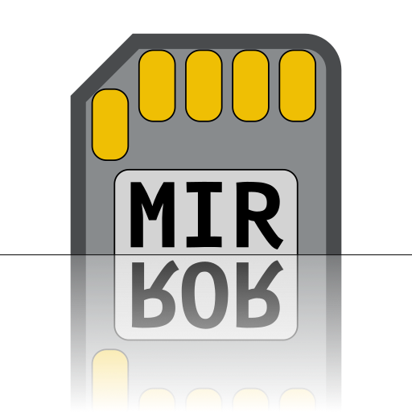
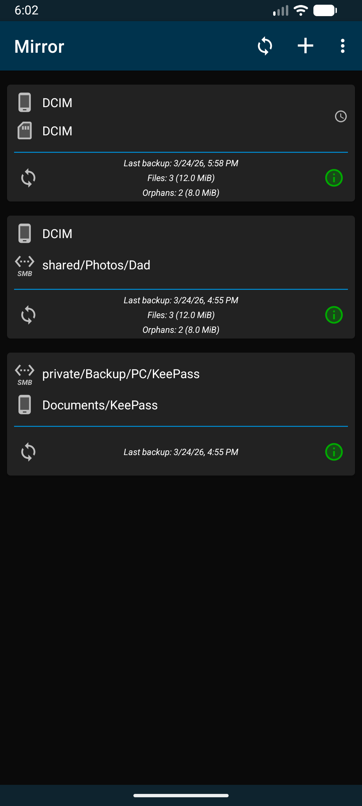
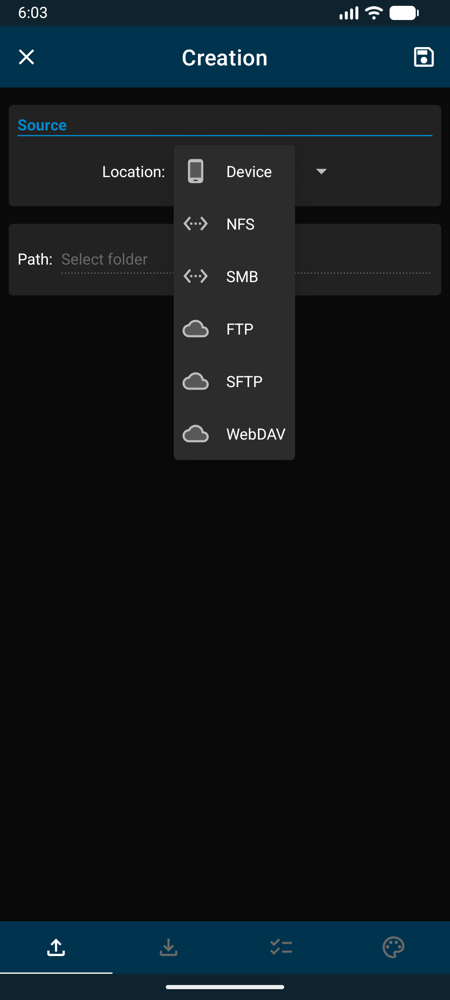
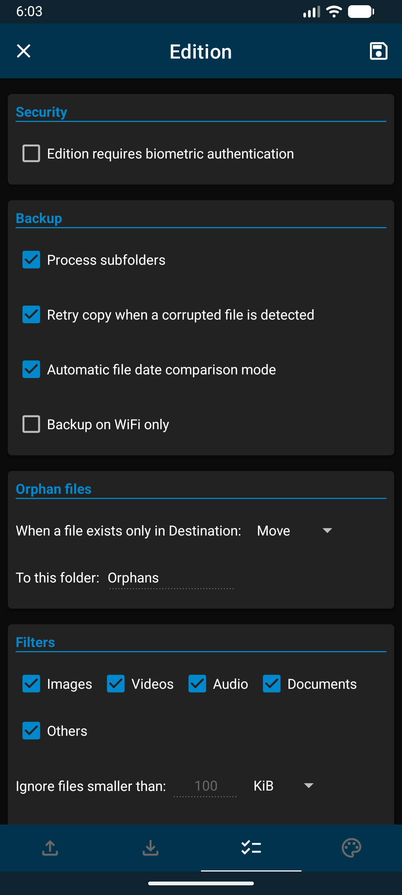
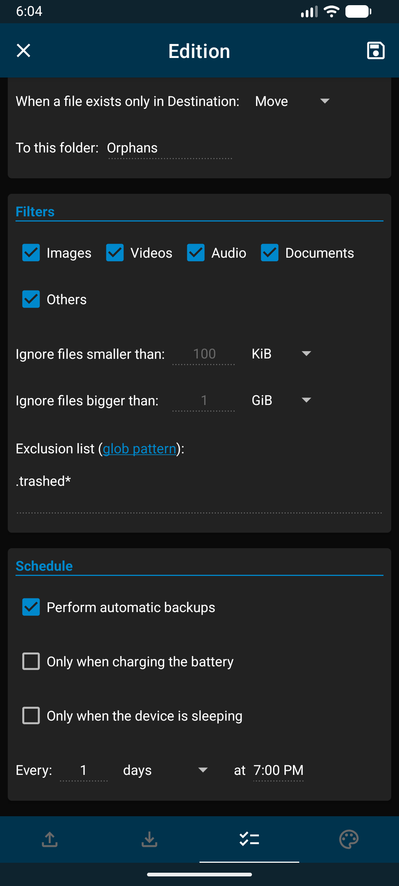
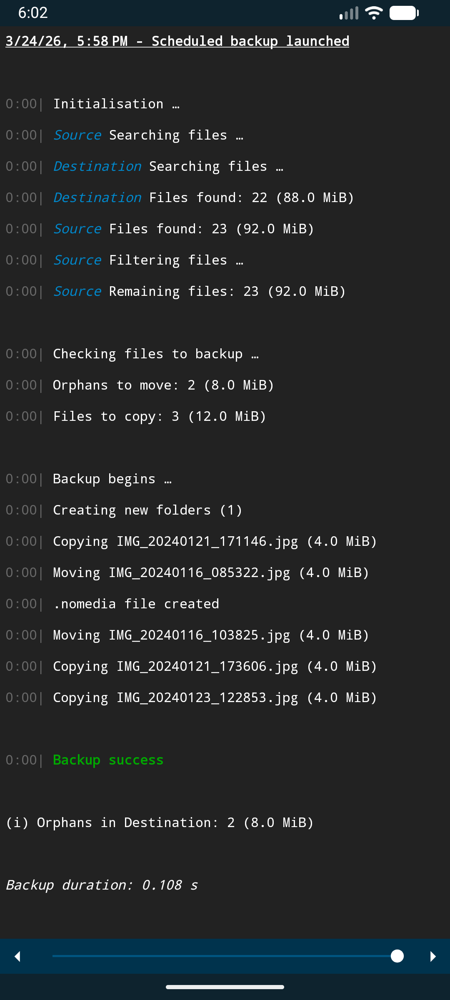
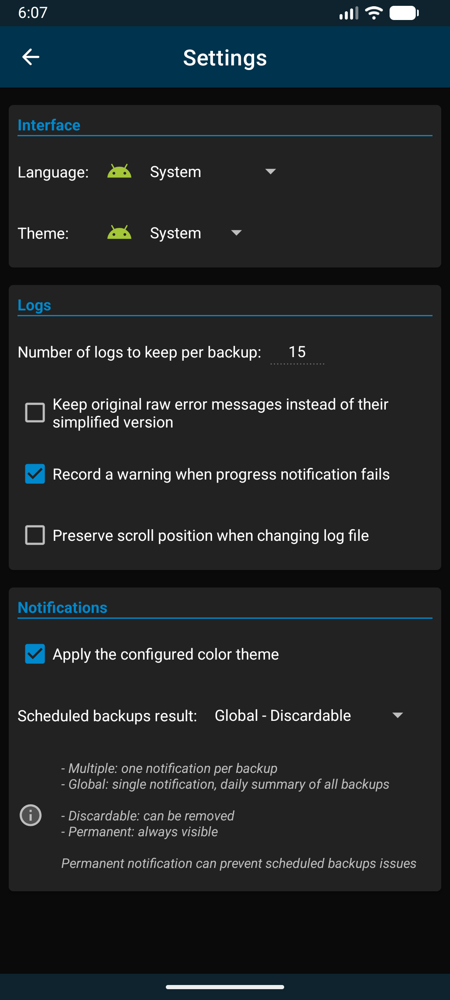
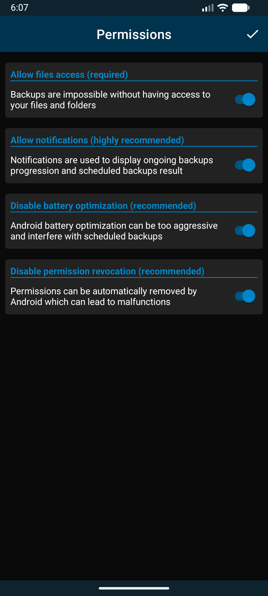

# \[Android\] Mirror

  

Mirror is a multi-protocol mirror-type backup application for Android.  
Designed to be simpler and lighter than synchronization software, it allows you to use your own infrastructure rather than third-party cloud services.

You can configure multiple backups as follows:

- Select a source directory
- Select a destination directory
- Choose filtering options (optional)
- Configure automatic scheduling (optional)

Mirror will analyze the contents of both directories, compare them and reproduce the structure of the source directory (subdirectories and files) in the destination directory, respecting the filtering options you have chosen.

The source and destination can be located on:

- Your device's internal or external storage
- An NFS share
- An SMB share
- An FTP or FTPS server
- An SFTP server
- A WebDAV server

---

## Security & Privacy

- **Local Storage:** Sensitive information is encrypted (AES-GCM + Android KeyStore) and stored locally on your device using a Room database.
- **No Tracking:** This application does not contain any analytics, trackers, advertising or proprietary software development kits (SDKs).

---

## Screenshots:

  
  
  
  
  
  
  

---

## Project Origins:

I started this amateur project around 2021 as a self-taught and completely inexperienced Android/Kotlin developer, because I couldn't find any apps that met my needs.  
I gradually adapted it for my family and friends until I realized its features could also be useful to others.

After some improvements and translations, I published it on the Google Play Store under a different name in 2023.  
Naively, I hadn't anticipated the time and money required for promotion, and the app remained under the radar for two years.

At the end of 2024, Google suddenly decided that a backup app whose sole purpose is to duplicate the structure of one directory into another should not have access to those directories:

    App Status: Rejected
    Issue found: Access to device storage not required

Since my appeals were also rejected and Google blocked all updates until I complied with their requirements (great for security, by the way), I'd had enough and put the Play Store adventure on hold for almost a year.

*If you are one of the few people who trusted my application, I am sincerely sorry about this ending and I hope this improved open-source version will allow me to redeem myself.*

I continued to improve the application for my own personal use, and by the end of 2025, I began to think that, while a multinational corporation wasn't the solution I was hoping for, perhaps the application could be useful in the open-source world?  
At least until Google manages to permanently ban sideloading…

---

## Q&A:

**Why are you declaring `android:usesCleartextTraffic="true"` on the AndroidManifest.xml file?**

This is an Android requirement to allow unencrypted FTP and WebDAV protocols.

**Why are you delcaring `android.permission.ACCESS_NETWORK_STATE`, `android.permission.ACCESS_WIFI_STATE` and `android.permission.CHANGE_WIFI_STATE` in the AndroidManifest.xml file?**

In the options, you can choose to perform your backup only via Wi-Fi, which requires checking your Wi-Fi connection status. If the backup was started manually, Mirror will prompt you to connect to your Wi-Fi network.

**Why are you not using Jetpack Compose?**

It was a new technology when I started Mirror, and I couldn't find the documentation or help topics I needed as a beginner developer on the forums.

**Will you migrate to Jetpack Compose?**

Perhaps, if necessary. Mirror was designed to avoid frequent opening after its initial setup. Would it benefit from Jetpack Compose? I don't know. As they say, "if it ain't broke, don't fix it".

**Why are you not providing a PIN or pattern fallback option for biometric authentication?**

If someone can launch Mirror, they likely already know your PIN or pattern and have used it to unlock your device. It seemed safer to limit biometric authentication for these specific situations.

**Why aren't my scheduled backups starting at the exact time they're supposed to?**

Mirror uses Android WorkManager instead of AlarmManager, which allows scheduled tasks to be postponed when the device is in sleep mode to conserve battery power.

**How can I remove these annoying blocks of explanatory text that appeared after setting up my first backups?**

Just tap on them.

**Can I reorganise my backup cards?**

Yes, tap the top of the card you want to move to bring up the edit buttons, then drag it from the six-dot icon on the right.

---

## Credits and Third-Party Licenses:

[EMC NFS](https://github.com/EMCECS/nfs-client-java): NFS v3 client - Licensed under Apache-2.0 by EMCECS

[SMBJ](https://github.com/hierynomus/smbj): SMB2/SMB3 client - Licensed under Apache-2.0 by hierynomus

[Commons Net](https://github.com/apache/commons-net): FTP client - Licensed under Apache-2.0 by the Apache Software Foundation

[JSch](https://github.com/mwiede/jsch): SFTP client - Licensed under BSD-style by mwiede

[Sardine-Android](https://github.com/thegrizzlylabs/sardine-android): WebDAV client - Licensed under Apache-2.0 by thegrizzlylabs

[OkHttp-Digest](https://github.com/rburgst/okhttp-digest): Digest authentication for WebDAV - Licensed under Apache-2.0 by rburgst

[Autostarter](https://github.com/judemanutd/AutoStarter): Opens the autostart permission manager - Licensed under MIT by judemanutd

---

## Support:

Mirror is a free and open-source application, distributed without advertising or tracking.  
If you find it useful and would like to support my work, a small donation would be greatly appreciated.

  

---

## AI Usage & Licensing:

This project is licensed under AGPLv3.  
For specific policies regarding AI assistance, scraping, and code generation, please refer to the AGENTS.md file.
